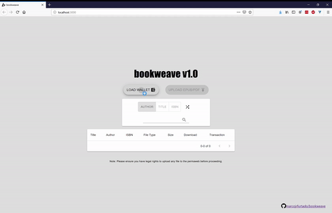
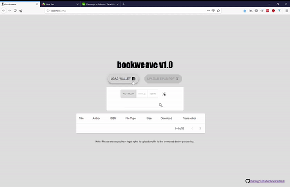
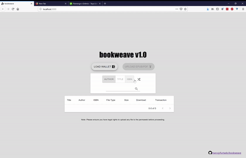

# bookweave

Share and search eBooks on the Permaweb.

## Live

Latest version will always be redirected by https://marcojrfurtado.github.io/bookweave/latest.html

### History

v1.0: https://arweave.net/8y1OFPvwFFdcEvjmigDyePNiIsDEDj-0nqDAwK_i53M

## Sample usage

### Uploading

You need to load your wallet before start uploading. Simply provide the JSON keyfile before.



### Searching

Search and download can be done without any AR fees, and without loading your wallet.



### Get random docs



## How to obtain an AR tokens?

Arweave is current distributing free tokens on https://tokens.arweave.org/. Make sure to grab it while it lasts.

## Limitations

Please be aware that that latest version currently has the following limitations:

* Search: bookweave relies on [ArQL](https://github.com/ArweaveTeam/arweave-js) for providing search capabilities. For this reason, only exact matches for author, title or ISBN are supported. The matching is, however, case-insensitive;

* ISBN: Given that only exact matches are enabled, ISBN should be the most appropriate search option to be used. However, there is not a good way to obtain them most of the time. You would think that most epub files would use this field as an identifier, but that is not the case. ISBN is just not provided as part of the metadata lots of times. If you have a suggestion, please make sure to raise an issue;

* Confirmation: The app will return success after an upload attempt whenever it receives a 200 status from Arweave when signing a transaction. That transaction still needs to be propagated on the network. If there is any instability with the network, and there has been a problem with it, we would not be able to alert the user, as we do not track it.

## FAQ

### bookweave returned a transaction number. Can I check its status somewhere else? Is download only available here?

You can also use ViewBlock to check the status of any transaction, or to download any eBook.

For example, let us assume you uploaded an epub file, and received a transaction id `58r3wilDh-DvOS7-_sOdf965bOb-UX0Dmkd3NNP23zc`. You can check its status on `https://viewblock.io/arweave/tx/58r3wilDh-DvOS7-_sOdf965bOb-UX0Dmkd3NNP23zc`

Once you land that page, simply click on **SHOW ENCODED DATA** to download the file.

### I lost my transaction ID, and I cannot find my book on bookweave

Given the ledger is public, and the address of your wallet is also known, simply enter it on ViewBlock to see the latet transactions. Given a wallet with id `y6yHKWeolQydOwLzIuWh3Cg6VTQAVEdf1qoOmJJyNaY`, for example, you can view its transactions through https://viewblock.io/arweave/address/y6yHKWeolQydOwLzIuWh3Cg6VTQAVEdf1qoOmJJyNaY

### How long do transactions take to be processed

As bookweave indicates, your transaction may take several minutes to be processed, although it varies. Do not expect any upload to be available right away.

## Running it locally

First install any requirements with
```
npm install
```

Then simply run `npm run build`, and open `dist/index.html` on your browser.

Alternatively, you can also run it within a server using:

```
npm start
```

Then open [http://localhost:3000](http://localhost:3000).

## Notes
Before uploading, you should be aware of the distribution rights of the material (e.g. copyright/copyleft), and make sure you are not infringing them.
